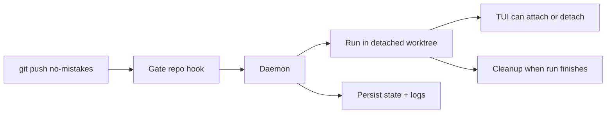

The daemon is a long-running background process that manages pipeline runs. The
installer prefers setting it up as a managed background service, and
`no-mistakes`, `init`, `attach`, `rerun`, and `update` keep that service
installed and running for you when that path is available.

## Why a daemon exists

The daemon exists so `git push no-mistakes` stays fast and the gate can keep
working after your shell command returns.

- Git hands the push to the local gate repo.
- The hook notifies the daemon and exits immediately.
- The daemon owns the long-running work: worktrees, pipeline execution, TUI
  events, state, cleanup, and crash recovery.



On macOS this is a per-user `launchd` agent, on Linux a per-user `systemd` service, and on Windows a Task Scheduler task. The installed artifact names are scoped by `NM_HOME` with a short stable suffix, so the paths and service identifiers look like `~/Library/LaunchAgents/com.kunchenguid.no-mistakes.daemon.<suffix>.plist`, `~/.config/systemd/user/no-mistakes-daemon-<suffix>.service`, and the Windows task `no-mistakes-daemon-<suffix>`. That keeps multiple `no-mistakes` installs from colliding when they use different `NM_HOME` roots. Those service managers keep the daemon available across CLI invocations and restart it after `no-mistakes update` replaces the binary. A managed service starts with a minimal environment, so at daemon startup it resolves `PATH` and proxy variables from your login shell and the baked-in service definition; [Environment the daemon sees](/no-mistakes/reference/environment/#environment-the-daemon-sees) owns that resolution story. Restart the daemon after changing those values. If managed service install or startup is unavailable or fails, `no-mistakes` falls back to starting a detached daemon process instead.

## Starting and stopping

Most people do not need to manage the daemon directly. The usual commands
already make sure it exists when needed.

```sh
# Explicit management
no-mistakes daemon start
no-mistakes daemon stop
no-mistakes daemon restart
no-mistakes daemon status

# Ensures the daemon is running, using the managed service when possible
no-mistakes
no-mistakes init
no-mistakes attach
no-mistakes rerun
no-mistakes axi run
no-mistakes axi respond

# Resets the daemon after replacing the binary
no-mistakes update
```

`no-mistakes update` stops and starts the daemon when it is running, or when stale daemon artifacts exist, so the new executable is used.
It prefers the managed service path and falls back to a detached daemon if service startup is unavailable or fails.
If pending or running pipeline runs exist, `update` refuses to restart the daemon by default and prints each active run's ID, status, branch, and short head SHA. Pass `--force` to restart the daemon anyway and accept that those runs may fail; `-y`/`--yes` does not bypass this guard. Runs parked at an approval or fix-review gate are exempt from this guard and from `--force`'s count: a stop or restart preserves them and the next daemon start resumes them, so `update` lists them under a separate preservation notice instead of counting them toward the refusal. That notice is printed only after the daemon has actually been stopped and restarted; a refusal, a failed download, or a failed restart preserves nothing, so none of them promises preservation. The exemption is conditional on resumability, checked against the same preconditions startup recovery applies: the run's worktree must still be on disk at the run's head, and its gate step must be complete rather than still holding a live agent. A parked run that fails either check counts as blocking, because the next start would refuse it too. `daemon stop`, `daemon restart`, and `update` all require a parked run's recorded step plan to match the pipeline layout the currently installed binary runs, because the executable that comes back can have been replaced since the run parked; a run recorded under a different or unrecorded layout cannot be assumed resumable and counts as blocking like any other active run. What is specific to `update` is the printed qualifier: an update also swaps the binary, and the incoming version's layout does not exist until after the download, so the preservation notice says so rather than promising a certainty the check cannot cover.
If the daemon is already running from a different executable path, update still prompts before replacing it; `-y`/`--yes` answers that prompt non-interactively.
If the daemon executable path cannot be determined, the update aborts before replacing anything.

`no-mistakes daemon stop` and `no-mistakes daemon restart` apply the same guard, including the same gate-parked exemption and the same step-plan check: if pending or running pipeline runs exist, each refuses by default and lists the active runs, and each takes its own `--force` to proceed anyway.
That `--force` override is available only to an ordinary top-level caller. A
process descended from an active validation-step agent cannot start, stop,
restart, or update the daemon; recursive containment refuses the command before
any lifecycle mutation, with no `--force` or `--yes` bypass.
Every invocation of `daemon stop`, `daemon restart`, or `update` - forced or not - logs the caller's PID, parent PID, and parent command line to `~/.no-mistakes/logs/cli.log` so a later incident can identify which agent or process triggered it.

The daemon writes an identity record to `~/.no-mistakes/daemon.pid` and listens on a Unix socket at `~/.no-mistakes/socket`. On Windows, it uses a localhost TCP listener and a protected endpoint file at the same path. CLI clients bound how long they wait for that socket to accept a connection with `daemon_connect_timeout` (default `3s`, override with `NM_DAEMON_CONNECT_TIMEOUT`), so a daemon process that is alive but stuck fails the connection instead of hanging the caller; see [Troubleshooting](/no-mistakes/guides/troubleshooting/#check-for-stale-artifacts).
Commands that ensure the daemon is running (`no-mistakes`, `init`, `attach`, `rerun`, `axi run`, `axi respond`) also fail fast rather than silently starting a replacement daemon when the socket file exists but nothing answers at all, such as a dead socket left behind by an unclean exit; `no-mistakes daemon start` self-heals past that case.
After accepting a shutdown request, `daemon stop` waits for the daemon process itself to exit before returning success. Losing IPC health is not enough because the listener closes near the start of shutdown, while the singleton lock and other process-owned resources are released only at process exit. `daemon restart` uses the same complete-stop handoff before starting the replacement, so the old and new processes do not contend for the root.

A clean stop does not fail every run it interrupts. A run parked at an approval or fix-review gate keeps its run row, its gate step, and its worktree, and the next daemon start resumes it at the same gate through [recovery on startup](#crash-recovery). A run counts as parked only when two facts agree: the run row carries the awaiting-agent marker, and one of its step rows is actually sitting at an approval or fix-review gate. A run interrupted mid-step is still cancelled and fails with "daemon shutting down". If the next start cannot resume a preserved run for a reason that can heal on its own - the network is unreachable so the repository's trusted configuration cannot be read, the agent CLI is not on `PATH`, a configuration file, a database row, or the worktree's own git state could not be read - the run is neither resumed nor failed: it keeps its row, its gate, and its worktree, and a later start picks it up. A read that did not complete never costs a run its worktree. Such a deferred run is still yours to end: `no-mistakes axi abort --run <id>` terminates it, and records it as cancelled by you rather than as a pipeline failure. A parked or deferred run also wins its branch against a newer push, both while the daemon runs and at the next start ([concurrent push handling](#concurrent-push-handling)). If a branch somehow ends up with more than one parked run, there is no run to prefer, so a start resumes none of them and keeps every one of their worktrees; that group needs you to abort the runs you do not want, since a later start on its own will not clear it. Only evidence a completed read actually returned, which cannot improve by waiting - a missing worktree, a head that no longer matches the run, an incomplete gate step, a drifted step plan - fails a preserved run, and then the recorded error names that reason. A response and a shutdown that arrive at the same moment are a genuine race, and either can win: a cancellation already visible when the gate is about to act preserves the run and the gate is presented again on resume, while a response accepted just before it resolves the gate as normal.

Process launch and daemon readiness are separate states. After taking the singleton lock, the daemon publishes its PID before exclusive crash recovery begins, but startup is not successful until the IPC server returns a real health response. `daemon start` allows up to 45 seconds for cold environment setup and recovery, reports a child that exits before readiness promptly, and never treats the PID file or a bound socket as proof that the daemon is ready. If detached startup times out, the command kills and reaps that child before returning; if managed startup fails, it cleans up the managed attempt before trying the detached fallback and preserves both errors when both paths fail.

Only one live daemon can own an `NM_HOME` at a time.
At startup - before crash recovery runs and before the socket is bound - the daemon takes an exclusive OS file lock on `~/.no-mistakes/daemon.lock` and holds it for the life of the process.
A second daemon started against the same root fails with "a no-mistakes daemon is already running for this NM_HOME" (with the holder's PID and start time when available) instead of stealing the first daemon's socket and running crash recovery against its live runs.
The OS releases the lock automatically when the owning process exits or crashes, even on SIGKILL, so unlike the PID file the lock can never go stale.
As an independent safety layer, the daemon also refuses to bind the Unix socket while something is still answering on it; only a provably stale socket file (nothing listening) is removed and rebound.

## CLI and daemon protocol versions

The CLI and the daemon speak a versioned IPC protocol, and both sides must be on the same version. That happens automatically when they come from the same binary; a skew means an old daemon is still running after a new binary was installed, or a stale CLI is being invoked against a current daemon.

A skew is reported, never worked around. Every command other than the three meta operations below fails closed with `ipc protocol version mismatch`, naming both versions and the remedy for whichever side is stale: run `no-mistakes daemon restart` when the daemon is the old one, or invoke the installed binary (then `no-mistakes init` in the repository to refresh its gate hooks) when the CLI is. A mismatch never starts a replacement daemon, so the running daemon and its active runs are left alone.

Three operations stay reachable under a skew, so the remedy itself is never blocked: the health probe, daemon shutdown, and the recursive-containment check that pipeline-control commands run first. `daemon stop`, `daemon restart`, and `update` therefore still work.

Consequences elsewhere:

- `git push no-mistakes` is rejected by the gate's pre-receive hook rather than starting a run against a daemon that may misread the request.
- `no-mistakes init` reports the skew but keeps the gate it created; `init` is idempotent, so re-run it once the versions match.
- `no-mistakes doctor` shows the daemon row as a warning with both versions and the remedy, instead of reporting it as stopped.
- Read-only surfaces (`no-mistakes status`, the `axi` home view) still render a skewed daemon as stopped.

## What it does

When a push arrives via the post-receive hook:

1. Creates a detached worktree at `~/.no-mistakes/worktrees/<repoID>/<runID>/`, or at `<root>/<runID>` when [`worktree_roots`](/no-mistakes/reference/global-config/#worktree_roots) names a directory for that repository. The placement is resolved once, at run creation, and recorded on the run, so editing the setting never retargets a run that already exists
2. Starts the pipeline executor in that worktree
3. Streams events to any connected TUI clients and serves request/response state to AXI clients
4. Cleans up the worktree when the run finishes (success or failure)

Event delivery is bounded, so a slow or wedged client can never stall a run. Under pressure the daemon may drop ordinary log output, but it never silently loses a state change: it coalesces those into a single gap signal, and the TUI and `axi` respond by re-reading authoritative run state. A live view can therefore skip log lines while it is behind, but it converges on the run's real state. After a dropped connection, the TUI retries with a bounded delay and reconciles when it reattaches; if the daemon remains unavailable, it surfaces the connection error instead of retrying forever.

Pipeline agents are prompted to keep intentional writes inside that detached worktree and avoid changing system state outside it, such as Homebrew packages, apps under `/Applications`, or global tool configuration.
That reduces surprising machine-level side effects and macOS App Management prompts, but it is prompt steering rather than a true sandbox.
While executing steps, the daemon also owns child-process cleanup.
Configured commands and one-shot agent subprocesses are terminated as a process tree on completion, failure, or cancellation so leaked test workers, build watchers, or dev servers cannot accumulate across runs.
Each process is asked to exit first and only forcibly killed if it is still running a few seconds later.
A process can still escape that tree by detaching itself into its own session, so when a run finishes the daemon also terminates anything still standing in that run's worktree before removing the directory.
That sweep is scoped by working directory: it never touches a worktree whose run is still active, and it can never reach a process working outside `~/.no-mistakes/worktrees/` or outside a run worktree a run record names in a configured worktree root.

## Concurrent push handling

If you push to the same branch while a run is already active, the daemon:

1. Cancels the in-progress run (reason: "cancelled: superseded by new push")
2. Waits for it to finish
3. Starts a new run with the latest push

The exception is a run parked at a gate, which is never cancelled this way: cancelling it would destroy a worktree holding unpushed pipeline commits. The push is refused instead, so respond to that run or abort it before pushing the branch again. The daemon also refuses the push rather than guessing when it cannot read whether the active run is parked, and a run it deferred at startup holds its branch the same way.

Pushes to different branches run concurrently.

This is another reason the daemon exists: branch-level coordination is easier to
reason about in one long-lived process than inside independent hook invocations.

## Crash recovery

On startup, the daemon checks for runs that were left in `pending` or `running` status, whether the previous daemon crashed while they were active or was stopped cleanly while one of them was parked at a gate:

- Completes legacy active rows whose persisted PR state is already `merged` or `closed`, including their CI step, before active-run recovery and parked-run planning
- Resumes a parked gate whose worktree and step history validate
- Re-resolves and validates any configured repository forge profile before rebuilding the recovered run, so resumed provider checks and agents use the same repository-scoped identity model rather than persisted credentials or ambient active accounts
- Fails a preserved run it cannot resume only on evidence a completed read actually returned, such as a missing worktree, a head that no longer matches, an incomplete gate step, or a drifted step plan, and records that reason on the run; a read that did not complete instead defers the run, which keeps its row, its gate, and its worktree for a later start
- Performs no stale-run sweep and no worktree cleanup at all when the active-run listing itself cannot be read, since a failed listing is not evidence that there is nothing to preserve
- Before resuming a parked CI gate, re-checks its persisted PR URL through the configured provider; a currently merged or closed PR completes the stale gate, while an open, unknown, or unreachable PR remains parked
- Preserves a run that was actively monitoring CI for an already-created PR as `ci_monitor_interrupted` rather than failing it: the PR is still open, so a restart mid-monitor is not a pipeline failure. That run is terminal and never resumed
- Before failing any other stale active run, verifies its managed worktree head and pins an unpublished descendant under the run-specific recovery ref so later rerun or guarded custody recovery does not fall back to a stale gate branch
- Marks every other stale active run as `failed` with the message "daemon crashed during execution", never a run it resumed or deferred
- Reaps orphaned managed agent servers left behind by a crashed daemon or setup wizard
- Terminates processes a crashed daemon left running in worktrees no run owns any more, using the same working-directory scoping as run cleanup plus a ten-minute age floor so a run starting concurrently with startup is never mistaken for a leak
- Removes orphaned worktree directories via `git worktree remove --force` - but never one whose run is still `pending` or `running`; under `~/.no-mistakes/worktrees/` that means leftovers from terminal runs plus directories with no matching run record, while in a [configured worktree root](/no-mistakes/reference/global-config/#worktree_roots) only the directories run records name are ever swept or removed. A `ci_monitor_interrupted` worktree is also kept when its checked-out commit differs from the run's last pushed commit, since it may still hold an unpushed CI auto-fix commit
- Migrates gates named by authoritative repository records, plus legacy directories with the strict `<repoID>.git` shape. Before changing an unstamped candidate, it validates that the directory is a bare repository without relying on the current directory or ancestor Git discovery; unrelated and malformed directories are rejected without hook or Git mutation
- For a validated legacy gate, installs or refreshes the no-mistakes-managed pre-receive admission and post-receive notification hooks, preserving an existing custom pre-receive hook behind the admission wrapper, then enables push-option support and reapplies per-worktree hook-path isolation
- Records a content-versioned gate configuration stamp only after the whole migration succeeds. Normal restarts check current stamped gates from the filesystem without rerunning the mutating Git commands
- Clears any parked-awaiting-agent marker so a recovered failed run is not shown as still waiting for `axi respond`

## Logging

Daemon lifecycle logs go to `~/.no-mistakes/logs/daemon.log`. Startup logs report concise phase durations, gate migration counts, and a final `daemon ready` message only after IPC health succeeds. Successful read-only IPC requests such as health and run-state reads appear only at `debug`; mutations, stream starts, lifecycle transitions, and failed requests remain visible at `info` or `warn`.

Managed Rovo Dev and OpenCode server stdout and stderr go to `~/.no-mistakes/logs/managed-server.log`, separate from concise server startup, exit, and failure summaries in the lifecycle log. Output written before the lifecycle logger is ready, plus direct crash output, goes to `~/.no-mistakes/logs/daemon-bootstrap.log`. The lifecycle log retains a 32 MiB current file and three backups, managed-server output retains a 16 MiB current file and two backups, and bootstrap/crash output retains a 1 MiB current file and two backups. Backups use `.1` for the newest retained file.

The setup wizard separately captures managed agent-server output in `~/.no-mistakes/logs/wizard-agent.log`. Each pipeline step writes to `~/.no-mistakes/logs/<runID>/<step>.log`, and fatal step errors are appended there so the step log includes the failure reason even when the detail comes from command stderr. `daemon stop`, `daemon restart`, and `update` invocations are logged separately to `~/.no-mistakes/logs/cli.log` with the caller's PID, parent PID, and parent command line.

Set the log level in global config:

```yaml
log_level: debug # debug | info | warn | error
```

## Shutdown

`no-mistakes daemon stop` stops the current daemon process without removing the managed service. The next `no-mistakes daemon start`, `no-mistakes`, `init`, `attach`, `rerun`, or `update` will start it again through the same service manager when available, or as a detached daemon otherwise.
The [starting and stopping](#starting-and-stopping) section owns the active-run
guard, the top-level `--force` override, and the separate validation-step
containment rule.

1. Cancels every active run, which fails a run interrupted mid-step but leaves a run parked at a gate preserved for the next start
2. Waits up to 30 seconds for goroutines to finish
3. Removes the PID file and socket
